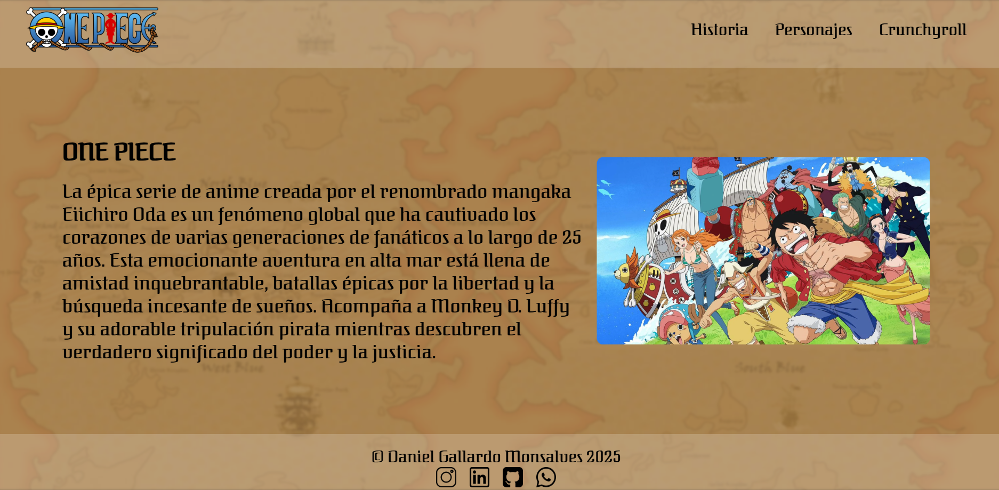
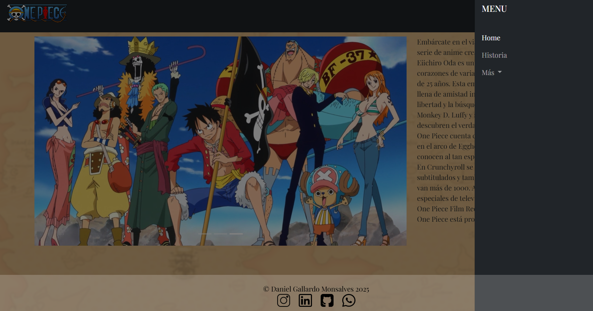
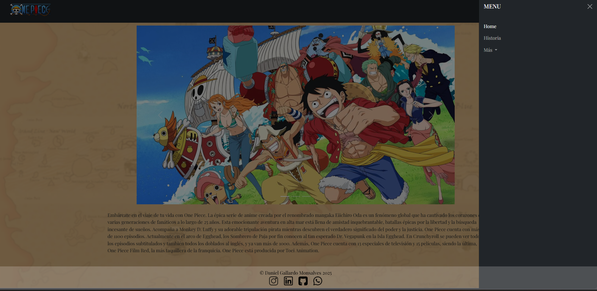

# 🌊 Práctica 2 - Página Web One Piece ⚓

Este proyecto es parte de mi curso de **HTML y CSS**.  
La práctica consiste en crear una página web dedicada a mi anime favorito: **One Piece** 🏴‍☠️.

---

## ✨ Contenido del proyecto
- 🏴‍☠️ Página principal con información sobre la serie.  
- 📄 Uso de **HTML semántico** para estructurar el contenido.  
- 🎨 Aplicación de **CSS** para dar estilo, colores y tipografías.  
- 🎨 Implementación de **variables CSS** para mantener una paleta de colores y estilos consistente.  
- 🖼️ Imágenes y detalles inspirados en el mundo pirata de *One Piece*.  
- 📦 Integración de **Bootstrap** para mejorar la maquetación y usar componentes responsivos.  

---

## 🛠️ Tecnologías utilizadas
  
  


---

## 📸 Primera vista previa
<p align="center">
  
</p>

---
## 📸 Segunda vista previa
<p align="center">
  
</p>

---
## 📸 Tercera vista previa
<p align="center">
  
</p>

---

## 🚀 Cómo usarlo
1. Clona este repositorio:
   ```bash
   git clone https://github.com/DaniGa-Mo/Anime_Favorito.git
2. Abre el archivo index.html en tu navegador favorito 🌐.

👨‍💻 Autor

Daniel Gallardo
📚 Estudiante y programador junior aprendiendo HTML, CSS, JavaScript.

🎉 Extra


"El tesoro existe. ¡Lo dejé todo allí! Reúnan a quien deseen, ¡y búsquenlo! Jajaja!" – Gol D. Roger 🏴‍☠️

